# SCH Deliverable 2 - PD vs TBI Classification using Speech Analysis

## Smart and Connected Health

---

# 1. Finalized Architectural Flow & System Design

## A. System Architecture Overview

Our system is a **speech-based ML classification pipeline** that distinguishes between Parkinson's Disease (PD) and Traumatic Brain Injury (TBI) patients using acoustic features extracted from speech recordings.

### System Architecture Diagram

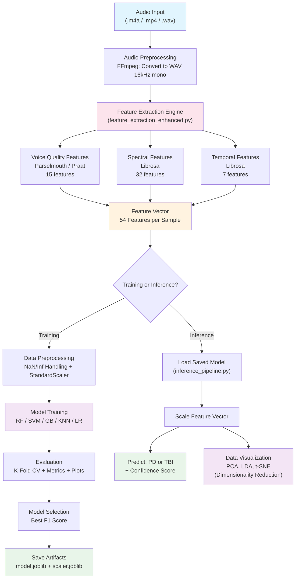

### Components Present in Our Project:
- **ML/AI Pipeline** - Full feature extraction -> training -> inference pipeline
- **Data Ingestion Pipeline** - Batch processing of audio folders (PD/TBI)
- **External Libraries** - Librosa, Parselmouth (Praat), scikit-learn

---

## B. Component-Level Design Artifacts

### i. ML/AI Pipeline (End-to-End)

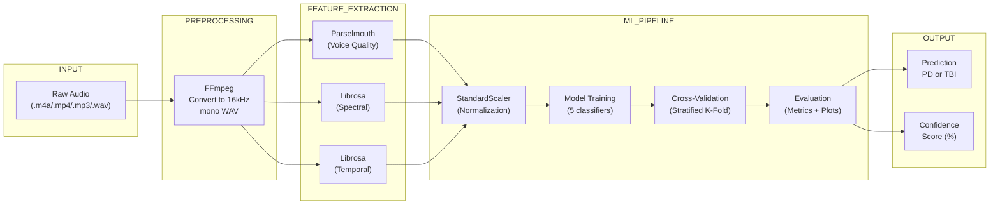

**Status: IMPLEMENTED** - All modules functional

---

### ii. Data Ingestion Pipeline

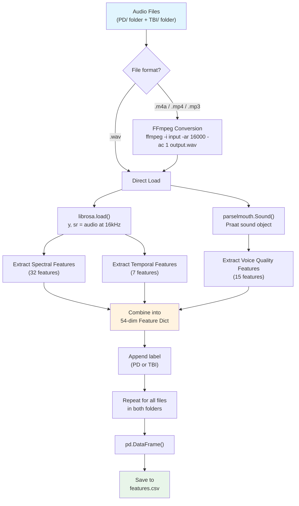

**Status: IMPLEMENTED** - `feature_extraction_enhanced.py` -> `process_all_files()`

---

### iii. Model Interaction Flow

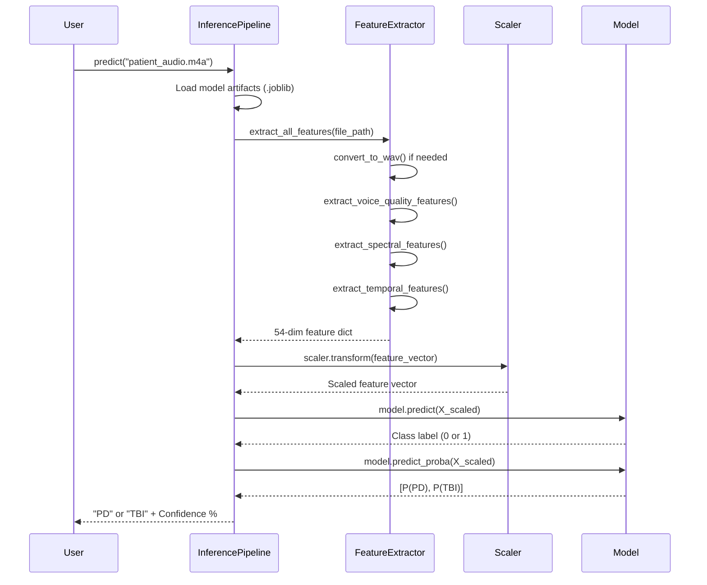

**Status: IMPLEMENTED** - `inference_pipeline.py` -> `predict()`

---

### iv. Training vs Inference Architecture

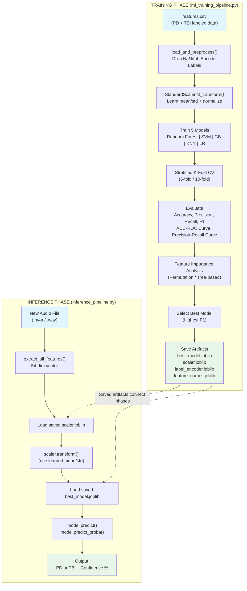

**Status: IMPLEMENTED** - Both phases fully functional

---

### v. Feature Extraction Engine - Internal Architecture

```mermaid
graph TD
    subgraph VOICE_QUALITY["Voice Quality (Parselmouth/Praat) - 15 features"]
        VQ1["Pitch Analysis\npitch_mean, pitch_std\npitch_min, pitch_max"]
        VQ2["Jitter Analysis\njitter_local\njitter_rap, jitter_ppq5"]
        VQ3["Shimmer Analysis\nshimmer_local\nshimmer_apq3, shimmer_apq5"]
        VQ4["Harmonicity\nhnr"]
        VQ5["Formant Analysis\nformant_f1, f2, f3, f4"]
    end

    subgraph SPECTRAL["Spectral (Librosa) - 32 features"]
        SP1["MFCCs\nmfcc_1 to mfcc_13"]
        SP2["Delta MFCCs\ndelta_mfcc_1 to delta_mfcc_13"]
        SP3["Spectral Shape\ncentroid, bandwidth\nrolloff, flatness\ncontrast, chroma"]
    end

    subgraph TEMPORAL["Temporal (Librosa) - 7 features"]
        TM1["Duration"]
        TM2["ZCR + RMS Energy"]
        TM3["Pause Analysis\nnum_pauses, pause_ratio"]
        TM4["Rhythm\nspeech_rate, tempo"]
    end

    VQ1 --> OUT["54-dim Feature Vector"]
    VQ2 --> OUT
    VQ3 --> OUT
    VQ4 --> OUT
    VQ5 --> OUT
    SP1 --> OUT
    SP2 --> OUT
    SP3 --> OUT
    TM1 --> OUT
    TM2 --> OUT
    TM3 --> OUT
    TM4 --> OUT

    style VOICE_QUALITY fill:#e8eaf6
    style SPECTRAL fill:#fce4ec
    style TEMPORAL fill:#e0f2f1
    style OUT fill:#fff3e0
```

---

### vi. Model Comparison Architecture

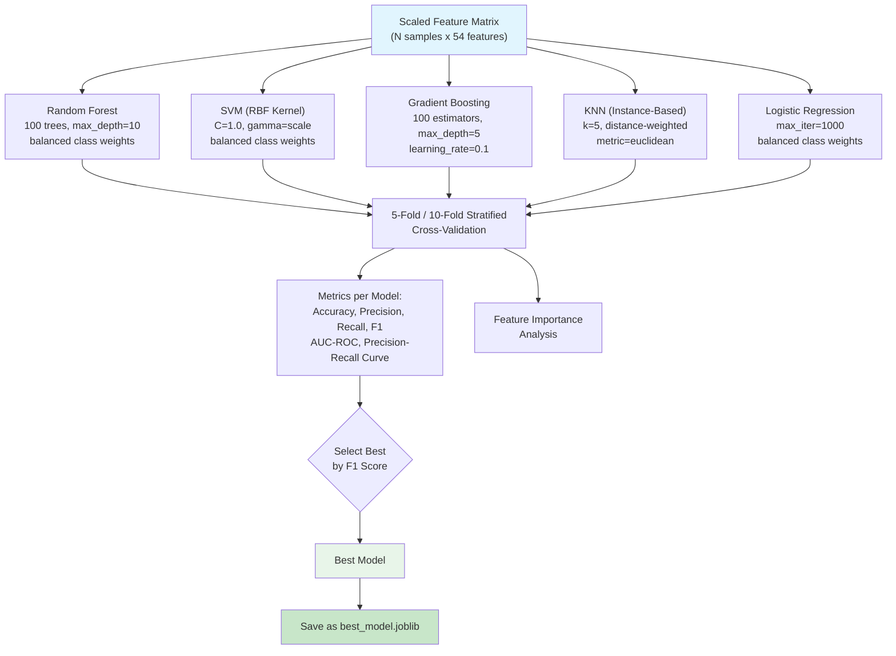

---

### vii. Module Dependency Diagram

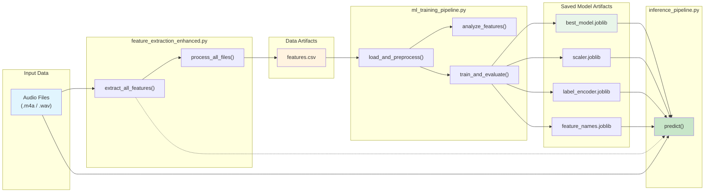

---

# 2. Technology Stack (Implemented & In Use)

## ML / AI Components

| Component | Technology | Status | Rationale |
|-----------|-----------|--------|-----------|
| **Feature Extraction (Voice Quality)** | Parselmouth (Praat) v0.4+ | Implemented | Gold standard for voice analysis; extracts pitch, jitter, shimmer, HNR, formants |
| **Feature Extraction (Spectral/Temporal)** | Librosa v0.10+ | Implemented | Industry standard for audio feature extraction; MFCCs, spectral features, pause detection |
| **Audio Conversion** | FFmpeg | Implemented | Robust, handles m4a/mp4/mp3 to WAV conversion |
| **ML Models** | scikit-learn v1.3+ | Implemented | Random Forest, SVM, Gradient Boosting, KNN, Logistic Regression |
| **Data Processing** | NumPy, Pandas | Implemented | Feature vector assembly, CSV handling, NaN/Inf cleanup |
| **Visualization** | Matplotlib, Seaborn | Implemented | Waveforms, spectrograms, MFCCs, pitch contours, feature charts |
| **Model Persistence** | Joblib | Implemented | Serialization of trained model, scaler, encoder |
| **Development Environment** | Google Colab (Python 3) | Implemented | Free GPU, pre-installed libraries, easy collaboration |

### Model Selected

We train and compare **5 classifiers**:

1. **Random Forest** (100 trees, max_depth=10, balanced class weights) - Robust ensemble, handles high-dimensional feature spaces well
2. **SVM with RBF kernel** (C=1.0, gamma=scale, balanced) - Strong on small datasets with high-dimensional features
3. **Gradient Boosting** (100 estimators, max_depth=5, lr=0.1) - Sequential ensemble, strong on tabular data
4. **K-Nearest Neighbors (KNN)** (k=5, distance-weighted, metric=euclidean) - Instance-based model, makes predictions based on similarity to nearest training samples
5. **Logistic Regression** (balanced, max_iter=1000) - Interpretable linear baseline

The best model is automatically selected based on **weighted F1 score**.

### Hosting Strategy
- **Development**: Google Colab notebooks for prototyping and training
- **Model Artifacts**: Saved as `.joblib` files, portable to any Python environment
- **Inference**: Standalone Python script (`inference_pipeline.py`) runnable locally or on any server

### Integration Method
- **Data Storage**: Google Drive for storing audio datasets and shared team access
- **Development Environment**: Google Colab / Jupyter Notebook for interactive prototyping, training, and evaluation
- **Model Serialization**: Joblib for serializing trained models, scalers, label encoders, and feature name lists as `.joblib` artifacts
- **Inference**: Standalone Python script (`inference_pipeline.py`) loads serialized artifacts and runs predictions locally or on any server
- Feature extraction is self-contained (no external API calls during inference)

### Current Performance Status
- Feature extraction successfully tested on real patient audio (HBOT_070 Grandfather Passage)
- 54 features extracted per audio file
- Model training pipeline ready; awaiting full labeled dataset (PD + TBI folders) to produce accuracy metrics

### Pivots from Initial Plan
- **Added 31 new features** beyond the original 23 in the starter code (total: 54)
- **Added multiple model comparison** instead of a single model approach
- **Added stratified k-fold cross-validation** for more robust evaluation on small datasets

### Cross-Validation Strategy
We use **stratified K-fold cross-validation** (5-fold and 10-fold) to ensure robust evaluation, especially given the small dataset size. Stratification preserves the PD/TBI class ratio in each fold, preventing biased splits. Both 5-fold and 10-fold results are reported to assess variance in model performance.

### Feature Importance Analysis
Feature importance analysis is one of our core research questions — identifying **which speech features are most discriminative** between PD and TBI patients. We employ multiple methods:
- **Tree-based feature importance**: Gini importance from Random Forest and Gradient Boosting models, ranking features by their contribution to classification splits
- **Permutation importance**: Model-agnostic method that measures the decrease in model performance when each feature's values are randomly shuffled
- **ANOVA F-test ranking**: Statistical test comparing PD vs TBI group means for each of the 54 features
- Top features are visualized as ranked bar charts to highlight which acoustic dimensions (voice quality, spectral, temporal) carry the most diagnostic value

### Evaluation Metrics
All models are evaluated with the following comprehensive metrics:
| Metric | Description |
|--------|-------------|
| **Accuracy** | Overall proportion of correct predictions |
| **Precision** | Proportion of predicted PD/TBI cases that are correct (per-class) |
| **Recall** | Proportion of actual PD/TBI cases correctly identified (per-class) |
| **F1 Score** | Harmonic mean of precision and recall (weighted) — primary model selection criterion |
| **AUC-ROC Curve** | Area Under the Receiver Operating Characteristic curve — measures discrimination ability across all thresholds |
| **Precision-Recall Curve** | Plots precision vs recall at various thresholds — especially informative for imbalanced datasets |

Additionally, **confusion matrices** are generated per model to visualize true/false positive/negative distributions.

---

# 3. Implementation Progress Summary

## Completed

| Module | File | Description |
|--------|------|-------------|
| Enhanced Feature Extraction | `feature_extraction_enhanced.py` | Extracts 54 features (voice quality + spectral + temporal) from audio files |
| ML Training Pipeline | `ml_training_pipeline.py` | Full training pipeline: preprocessing, feature analysis, 4-model comparison, evaluation, model saving |
| Inference Pipeline | `inference_pipeline.py` | Loads saved model and predicts PD/TBI from new audio with confidence scores |
| Colab Notebook | `PD_TBI_Classification_Notebook.ipynb` | All-in-one notebook for end-to-end execution in Google Colab |

## Currently Under Development
- Collecting PD and TBI audio samples to build the full training dataset
- Hyperparameter tuning (grid search / Bayesian optimization)

## Remains to Be Implemented
- Full model training once labeled PD + TBI datasets are available
- Integration with a frontend/mobile app (out of scope for ML deliverable)
- Real-time audio streaming inference

---

## Demonstration Evidence

### Feature Extraction Output (Real - HBOT_070 Sample)

54 features were successfully extracted from the sample audio file `20250319_141117_HBOT_070_Grandfather.m4a`:

| Feature | Value |
|---------|-------|
| pitch_mean | 119.68 Hz |
| pitch_std | 88.45 Hz |
| pitch_min | 73.25 Hz |
| pitch_max | 499.46 Hz |
| jitter_local | 0.0313 |
| jitter_rap | 0.0145 |
| jitter_ppq5 | 0.0164 |
| shimmer_local | 0.1670 |
| shimmer_apq3 | 0.0753 |
| shimmer_apq5 | 0.1089 |
| hnr | 7.67 dB |
| formant_f1 | 661.34 Hz |
| formant_f2 | 1891.99 Hz |
| formant_f3 | 2859.63 Hz |
| formant_f4 | 3858.63 Hz |
| mfcc_1 | -396.17 |
| spectral_centroid | 1403.05 Hz |
| spectral_bandwidth | 1352.01 Hz |
| spectral_rolloff | 2796.81 Hz |
| duration | 54.53 s |
| num_pauses | 42 |
| pause_ratio | 0.2969 |
| speech_rate | 0.7886 seg/s |
| tempo | 98.68 BPM |
| *(+ 30 more features)* | |

---

### Visualization Outputs (Real - from HBOT_070 audio)

**The following plots were generated from the actual patient audio file:**

#### 1. Waveform
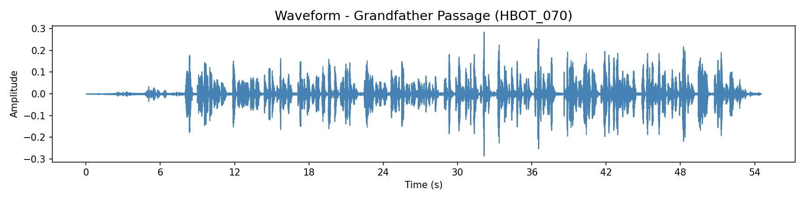
*Shows the amplitude of the speech signal over the 54.5-second Grandfather Passage recording. Visible speech segments and pauses.*

#### 2. Mel Spectrogram
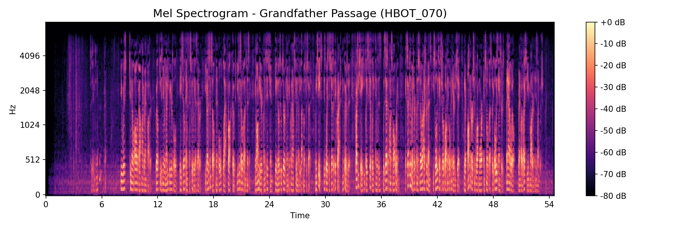
*Frequency content over time. Darker vertical bands indicate pauses. Energy concentration in lower frequencies is typical for male speech.*

#### 3. MFCCs (13 Coefficients)
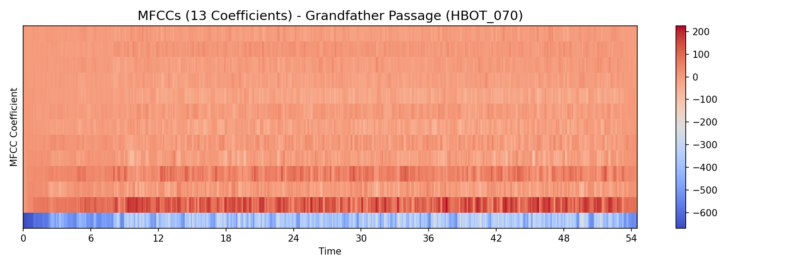
*Mel-frequency cepstral coefficients over time. These capture the "voice texture" and are key features for speech classification.*

#### 4. Pitch Contour (F0)
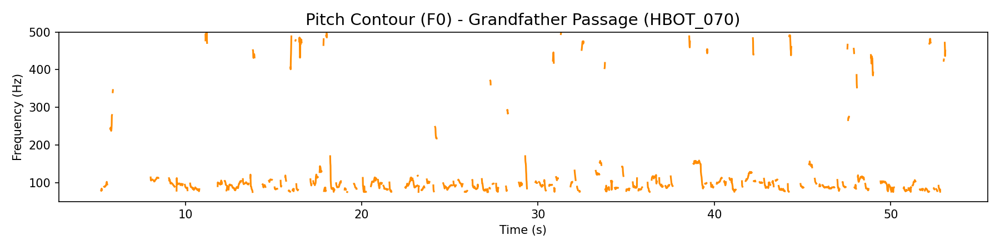
*Fundamental frequency over time. Mean pitch ~120 Hz. Gaps indicate unvoiced segments or pauses. Note the pitch instability (high jitter = 0.031).*

#### 5. Feature Summary
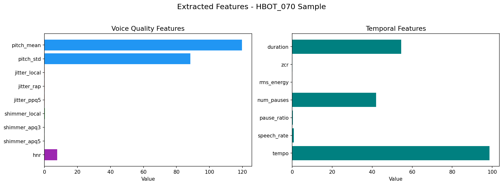
*Bar chart of extracted voice quality features (left) and temporal features (right) for this sample.*

#### 6. Pause Detection
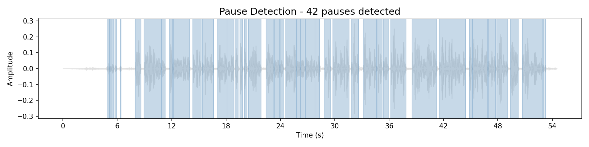
*Blue shaded regions = detected speech segments. 42 pauses detected, pause ratio = 29.7% of total duration.*

---

## Code Architecture Overview

```
output/
|-- feature_extraction_enhanced.py   # 54-feature extraction engine
|-- ml_training_pipeline.py          # Training & evaluation pipeline
|-- inference_pipeline.py            # Production inference
|-- PD_TBI_Classification_Notebook.ipynb  # All-in-one Colab notebook
|-- SCH_Deliverable_2_Report.md      # This deliverable report
|-- plot_waveform.png                # Waveform visualization
|-- plot_spectrogram.png             # Mel spectrogram
|-- plot_mfccs.png                   # MFCC heatmap
|-- plot_pitch_contour.png           # Pitch (F0) contour
|-- plot_feature_summary.png         # Feature bar charts
|-- plot_pause_detection.png         # Pause detection overlay
```

---

# 4. Updated Implementation Roadmap

## Core Component Completion

| Milestone | Status | Date |
|-----------|--------|------|
| Starter code (23 features) | Completed | Week 1 |
| Enhanced feature extraction (54 features) | Completed | Week 2 |
| ML training pipeline (5 models) | Completed | Week 3 |
| Evaluation framework (CV, metrics, plots) | Completed | Week 3 |
| Inference pipeline | Completed | Week 3 |
| Colab notebook (all-in-one) | Completed | Week 3 |
| Data collection (PD/TBI samples) | In Progress | Week 4 |
| Full model training + evaluation | Planned | Week 4-5 |
| Final model selection & report | Planned | Week 5 |

## Dependencies Between Modules

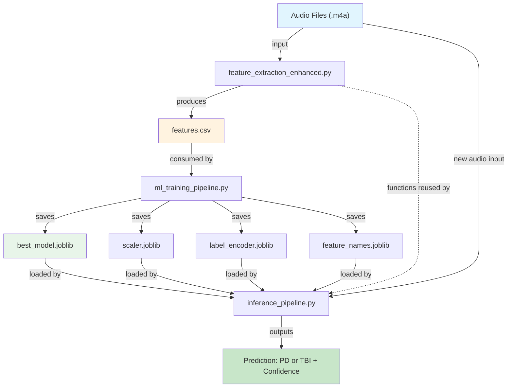

- **feature_extraction_enhanced.py** must run before training (produces the CSV)
- **ml_training_pipeline.py** must complete before inference (produces model artifacts)
- **inference_pipeline.py** depends on both feature extraction functions and saved model artifacts

## Technical Risks Identified

| Risk | Severity | Mitigation |
|------|----------|------------|
| Small dataset (few PD/TBI samples) | High | Use stratified K-fold CV, balanced class weights, data augmentation |
| Overfitting on limited data | High | Regularization (max_depth limits, C parameter), cross-validation |
| Audio quality variation across recordings | Medium | Standardize to 16kHz mono WAV; normalize with StandardScaler |
| NaN/Inf in extracted features (e.g., no pitch detected) | Medium | Replace with median values; skip corrupted files gracefully |
| Model generalizability to new patients | Medium | Reserve holdout test set from different patients |

## Updated Timeline

| Week | Tasks |
|------|-------|
| Week 1 (Completed) | Environment setup, audio basics, run starter code |
| Week 2 (Completed) | Enhanced feature extraction (54 features), batch processing |
| Week 3 (Completed) | ML pipeline, training code, evaluation code, inference pipeline |
| Week 4 (Current) | Data collection, run full training with labeled data |
| Week 5 | Final model selection, performance benchmarking, deliverable submission |

---

# 5. Output File Descriptions

## Python Source Files

### `feature_extraction_enhanced.py` - Feature Extraction Engine
Extracts **54 speech features** from any audio file (.m4a, .mp4, .mp3, .wav). Core signal processing module.

| Function | Purpose |
|----------|---------|
| `convert_to_wav(input_path)` | Uses FFmpeg to convert non-WAV audio to 16kHz mono WAV |
| `extract_voice_quality_features(sound)` | Parselmouth/Praat: pitch (4), jitter (3), shimmer (3), HNR (1), formants (4) |
| `extract_spectral_features(audio, sr)` | Librosa: MFCCs (13), delta MFCCs (13), centroid, bandwidth, rolloff, flatness, contrast, chroma |
| `extract_temporal_features(audio, sr)` | Librosa: duration, ZCR, RMS energy, pause count, pause ratio, speech rate, tempo |
| `extract_all_features(file_path)` | Master function combining all three extractors into 54-feature dict |
| `process_all_files(pd_folder, tbi_folder)` | Batch processes PD and TBI folders, returns DataFrame |

### `ml_training_pipeline.py` - Model Training & Evaluation
Takes extracted features CSV, trains 5 classifiers, evaluates with cross-validation, saves best model.

| Function | Purpose |
|----------|---------|
| `load_and_preprocess(csv_path)` | Load CSV, handle NaN/Inf, encode labels, fit StandardScaler |
| `analyze_features(csv_path)` | PD vs TBI group statistics, ANOVA F-test feature ranking, feature importance (permutation & tree-based), bar chart |
| `train_and_evaluate(X, y, ...)` | Train RF/SVM/GB/KNN/LR, 5-fold stratified CV, confusion matrix, ROC curve, PR curve, feature importance |

### `inference_pipeline.py` - Prediction on New Audio
Loads saved model artifacts and predicts PD vs TBI from a new audio recording.

| Function | Purpose |
|----------|---------|
| `load_model(model_dir)` | Load best_model.joblib, scaler.joblib, label_encoder.joblib, feature_names.joblib |
| `predict(file_path)` | Extract features -> scale -> predict class + probability |
| `batch_predict(folder_path)` | Run predictions on all audio files in a folder |

### `PD_TBI_Classification_Notebook.ipynb` - All-in-One Colab Notebook
Single Google Colab notebook combining all modules into a runnable cell-by-cell workflow. Designed for the course's Colab-based environment.

---

## Appendix: Full Feature Reference (54 Features)

### Voice Quality Features (15) - Parselmouth/Praat
| # | Feature | Clinical Significance |
|---|---------|----------------------|
| 1 | pitch_mean | Average fundamental frequency - gender/age marker |
| 2 | pitch_std | Pitch variation - monotone speech detection (low in PD) |
| 3 | pitch_min | Minimum pitch in utterance |
| 4 | pitch_max | Maximum pitch in utterance |
| 5 | jitter_local | Local pitch instability - strong PD indicator |
| 6 | jitter_rap | Relative average perturbation - voice tremor |
| 7 | jitter_ppq5 | 5-point pitch perturbation quotient |
| 8 | shimmer_local | Local amplitude instability - weak voice |
| 9 | shimmer_apq3 | 3-point amplitude perturbation |
| 10 | shimmer_apq5 | 5-point amplitude perturbation |
| 11 | hnr | Harmonics-to-noise ratio - breathiness/hoarseness |
| 12 | formant_f1 | First formant - vowel openness |
| 13 | formant_f2 | Second formant - tongue position |
| 14 | formant_f3 | Third formant - lip rounding |
| 15 | formant_f4 | Fourth formant - vocal tract length |

### Spectral Features (32) - Librosa
| # | Feature | Description |
|---|---------|-------------|
| 16-28 | mfcc_1 to mfcc_13 | Mel-frequency cepstral coefficients - voice texture |
| 29-41 | delta_mfcc_1 to delta_mfcc_13 | Rate of change of MFCCs - temporal dynamics |
| 42 | spectral_centroid | Center of mass of spectrum (brightness) |
| 43 | spectral_bandwidth | Frequency spread |
| 44 | spectral_rolloff | Frequency below which 85% of energy lies |
| 45 | spectral_flatness | Noise-like vs tone-like quality |
| 46 | spectral_contrast | Peak-valley difference in spectrum |
| 47 | chroma_mean | Pitch class energy distribution |

### Temporal Features (7) - Librosa
| # | Feature | Description |
|---|---------|-------------|
| 48 | duration | Total audio length in seconds |
| 49 | zcr | Zero crossing rate - noisiness indicator |
| 50 | rms_energy | Root mean square energy - loudness |
| 51 | num_pauses | Number of detected silences |
| 52 | pause_ratio | Proportion of time spent in silence |
| 53 | speech_rate | Speaking speed (segments per second) |
| 54 | tempo | Estimated beat tempo |
